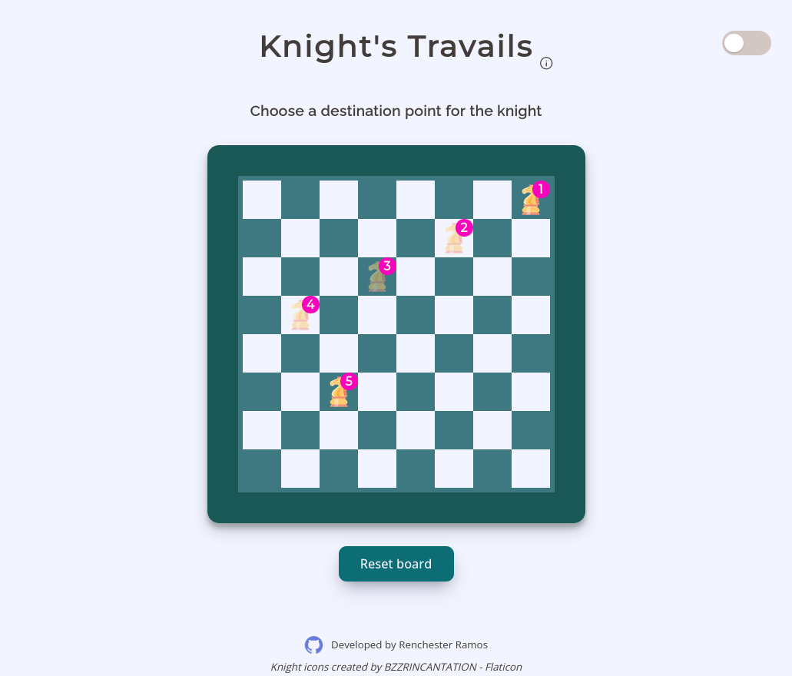

## The Odin Project

# Project: Knights Travails

[**Live version** of the site can be found here](https://renchester.github.io/knights-travails/)

A vanilla JS app that finds the shortest path a knight can take across a chessboard. The app uses breadth-first search across a tree data structure to find the shortest path between point A and point B. Sass is used to create the visual representation of the path taken.

### Built With

- Vanilla JS
- HTML5
- Sass

### Getting Started

In order to setup and work on this project on your own, you will need to:

1. Clone this project:  
   `git clone https://github.com/renchester/knights-travails.git`

2. Once you have cloned this project, you can install the required dependencies by using:  
   `npm install`

3. A live demo of the project can be started by using:  
   `npm start`

4. Distribution files can be produced using:  
   `npm run build`

### Acknowledgments

Knight icon used for the project is from [Flaticon](https://www.flaticon.com/free-icons/knight).

### Deployed on GitHub Pages

Deployed on [GitHub Pages](https://pages.github.com/)

### Display

Display of the page

---

Developed by **Renchester Ramos**
